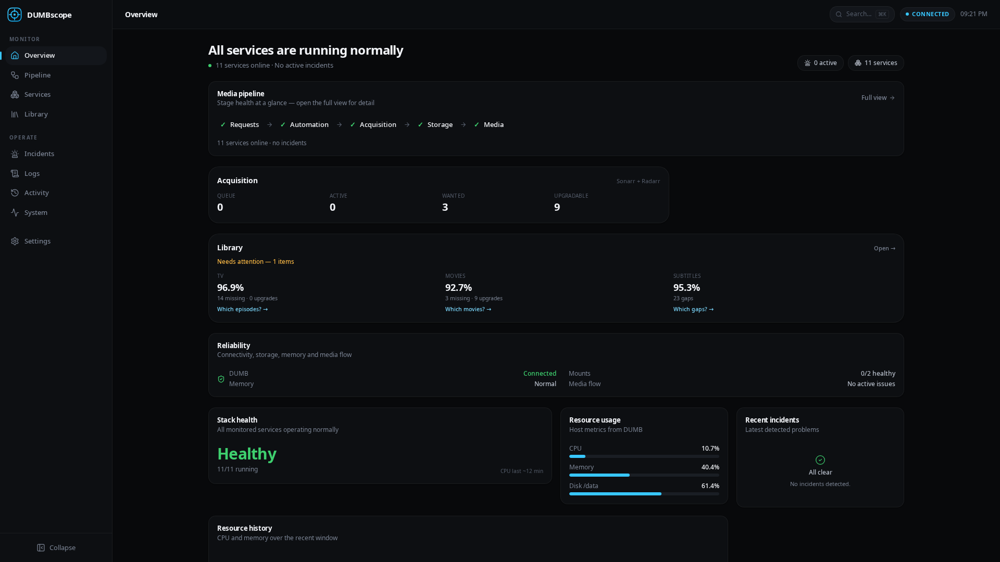
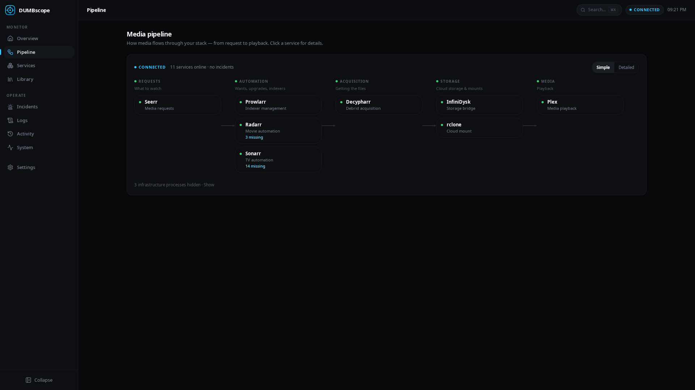
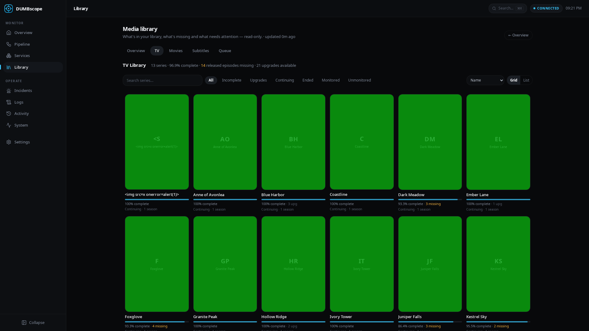
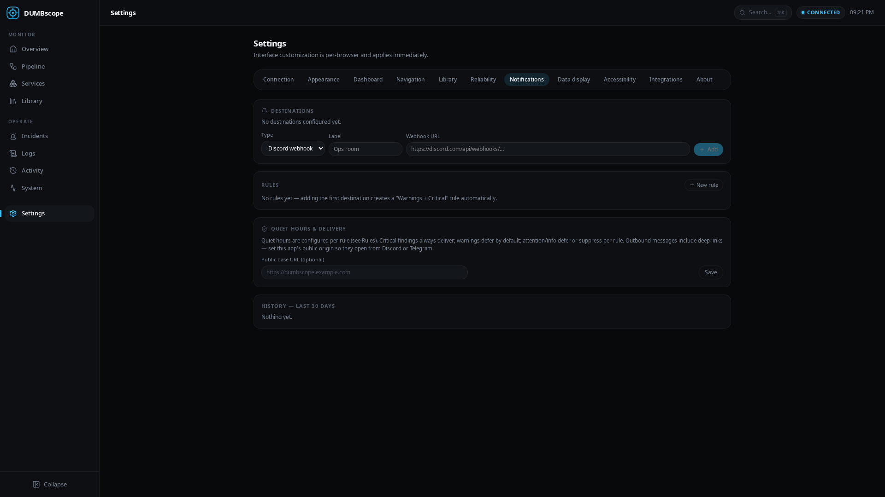

<div align="center">


# DUMBscope

**Observability, library intelligence and reliability tooling for DUMB.**

Monitor every service DUMB manages, understand your media pipeline,
troubleshoot with correlated incidents and logs, browse your library, and
recover safely — from one calm, dark dashboard.

One container · One `/config` · No Docker socket · No external database · No telemetry

[](https://github.com/Cyxno/DUMBscope/releases)
[](https://github.com/Cyxno/DUMBscope/actions/workflows/ci.yml)
[](https://github.com/Cyxno/DUMBscope/pkgs/container/dumbscope)
[](LICENSE)

</div>

---

## What is DUMBscope?

DUMBscope connects to the published **DUMB gateway on port 3005** (REST +
WebSockets), mirrors what DUMB reports into a normalized, correlated view, and
adds an incident engine with fingerprints, deduplication, dependency-aware
root-cause analysis — plus a read-only library browser that talks to Sonarr,
Radarr and Bazarr directly.

It answers, at a glance:

- Is my DUMB stack healthy — and which service is degraded, and **why**?
- What does my media pipeline look like right now?
- What is in my library, what is missing, what can be upgraded?
- What happened around a past incident, and did it recover?

DUMBscope is a companion to DUMB, not a replacement for its configuration UI.
Towards your stack it is **observation-first**: the only write paths are three
narrowly allowlisted Safe Actions (search-again, refresh, restart — always
explicit, confirmed, audited and cooldown-guarded; see docs/ACTIONS.md) and a
remediation _recommendation_ layer that stays off unless you enable it.

## Screenshots

All screenshots use fictional mock data.

| Overview                                            | Pipeline                                                           |
| --------------------------------------------------- | ------------------------------------------------------------------ |
|      |                     |
| **Library — TV**                                    | **Notifications**                                                  |
|  |  |

More in [docs/screenshots](docs/screenshots) (services, incidents, activity,
logs, system, movies, subtitles, mobile).

## Features

- **Overview** — stack-health headline, stage-chip pipeline summary, library
  intelligence, reliability status, resource usage and history.
- **Pipeline** — the dependency graph of _your_ stack, grouped by stage
  (requests → managers → indexers → debrid/bridge → mount → media server).
  Unknown services appear as generic nodes; nothing is hardcoded to one layout.
- **Services** — auto-discovered from DUMB: health, run state, CPU/RAM,
  restart statistics, deep-dive drawer, card & compact views, search.
- **Observability** — DUMB cgroup v2 memory breakdown with rate-based
  interpretation (soft-limit reclaim, hard-limit hits, pressure, OOM — high
  memory alone is never a problem), per-service memory classification
  (stable / elevated plateau / workload-driven / sawtooth / possible leak)
  with 24h p50/p95 baselines, deltas and baseline-shift detection, InfiniDysk
  repair-loop and 430-article aggregation, Sonarr/Radarr stack facts,
  download-routing statistics (Decypharr vs InfiniDysk, primary badge,
  preferred protocols), thermal spike correlation and a combined incident
  timeline. See [docs/OBSERVABILITY.md](docs/OBSERVABILITY.md).
- **Library** — unified read-only browser: Sonarr TV, Radarr movies, Bazarr
  subtitles; missing/upgrades/queue intelligence; per-item drawers (seasons,
  episodes, quality, subtitle coverage); media-flow correlation
  (grab → download → import → library).
- **Safe Actions** — a deliberately narrow control plane: targeted _Search
  again_ / _Search season_ / _Refresh_ commands for Sonarr and Radarr from
  the Library, _Open {Service}_ deep links, and confirmed _Restart service_
  via DUMB's own management route. Allowlist-only, audited, capability-gated
  — see [docs/ACTIONS.md](docs/ACTIONS.md).
- **Incidents** — sustained-failure detection with grace periods and
  hysteresis (no flapping), fingerprint-based deduplication with occurrence
  counts, dependency correlation ("root cause: PostgreSQL"), timeline,
  evidence, log context. Honest lifecycle: detectors prove recovery (or
  retire findings whose target is gone — labelled, never disguised as
  recovery), operators can acknowledge and archive, and the default view
  answers "what needs attention right now?".
- **Self-monitoring** — DUMBscope watches itself: RSS/heap, event-loop lag,
  open FDs, worker threads, SSE clients, DB/WAL size, reconciliation and
  probe runtimes — with rolling baselines, robust trend estimates and
  sustained-evidence findings for its own leak/regression classes.
- **Logs** — realtime stream from all DUMB services: level/service filters,
  search, pause/resume, incident deep-links, capped ring buffers.
- **System** — CPU/memory/disk/network from DUMB, per-process metrics,
  database-health observations; mount/symlink health and memory-anomaly
  findings under Reliability.
- **Notifications** — forward findings and recoveries to Discord, Telegram
  and the browser, with rules, filters, dedupe, quiet hours, rate caps and a
  30-day history.
- **Activity** — an append-only feed of observed facts. Nothing invented.
- **Customization** — themes (dark, OLED, light, system), accents, density,
  sidebar modes, dashboard presets, library preferences, landing page — per
  browser, applied live.
- **Command palette** (⌘/Ctrl+K) and a responsive mobile layout.

## Compatibility

DUMBscope renders **every service DUMB's process registry reports**. Known
services get their canonical name, icon, category and pipeline stage; anything
unknown falls back to honest generic monitoring. A running process without a
health report is shown as **Running (unverified)** — never as healthy.

Compact matrix (full table with per-service support levels and evidence in
[docs/COMPATIBILITY.md](docs/COMPATIBILITY.md)):

| Service                                                                                                     | Monitoring                | Deep integration                        | Verified        |
| ----------------------------------------------------------------------------------------------------------- | ------------------------- | --------------------------------------- | --------------- |
| DUMB Frontend / DUMB API                                                                                    | Full                      | —                                       | Real tested     |
| Sonarr · Radarr · Bazarr                                                                                    | Full                      | Library browsers, subtitles, media flow | Real tested     |
| Prowlarr · Plex · Seerr · Tautulli                                                                          | Full + deep health poller | —                                       | Real tested     |
| Decypharr · InfiniDysk                                                                                      | Full + deep observability | Repair loops, 430s, routing, GC limit   | Real tested     |
| Jellyfin · Emby · Lidarr · Whisparr · AltMount · CLI Debrid · Zurg · rclone · Traefik · Authelia · and more | Full generic monitoring   | Not yet implemented                     | Contract tested |

Multi-instance services (Sonarr Default + "Sonarr Anime", Radarr 4K, …) are
rendered per instance with a qualifier and never collide. Deep integration
means a native adapter with API/domain data exists today — everything else is
reported honestly as basic monitoring rather than claimed.

## Reliability

- **Honest DUMB connectivity** — one derived state machine: amber states
  (starting/connecting/reconnecting/degraded/stale) never page you, proven
  outages open a critical incident, recovery is automatic.
- **Mount & symlink health** — read-only stat probes and bounded symlink
  sampling for your debrid mounts and symlink roots; findings require
  sustained evidence and recover with hysteresis.
- **Memory anomaly detection** — rolling-median baselines per process;
  warnings need absolute AND relative evidence, recovery must be sustained.
- **Media-flow correlation** — repeated acquisition requests, download/state
  mismatches and failing imports surface as findings in the same incident
  model.
- **Safe remediation** — exactly one action: `restart-managed-service` via
  DUMB's own management route, guarded by explicit confirmation, cooldowns,
  attempt caps and verification.

## Safe Actions

The control-plane layer on top of observability — narrow by design, honest by
default. Full documentation in [docs/ACTIONS.md](docs/ACTIONS.md).

- **Targeted media commands** — _Search again_ on a missing episode or movie,
  _Search season_ on a season with gaps, _Refresh_ a series/movie. Every
  command targets exact upstream ids through Sonarr/Radarr's official
  command API; "Search requested" is never rendered as "media found".
- **Open {Service}** — deep links into each service's own web UI
  (Sonarr series page, Radarr movie page, service root otherwise), with an
  optional per-integration public URL and an Auto/Internal/Public
  preference for home-vs-reverse-proxy use.
- **Restart service** — from the service drawer, behind an explicit
  confirmation, reusing the remediation layer's allowlist, 6 h cooldown,
  attempt caps, audit and verification.
- **Audit** — every attempt persisted before execution (actor, target,
  result, duration, upstream command id — no secrets), surfaced under
  Activity → Recent actions; 14-day retention.

## Library

- **Sonarr TV browser** — series grid with search, filters (incomplete,
  upgrades, monitored, …), sorting and pagination; season/episode drawer with
  quality and subtitle chips.
- **Radarr movies** — movie grid with quality distribution, missing and
  upgrade views, per-movie drawer.
- **Bazarr subtitles** — language profiles, configured languages, movie and
  episode gap lists with drill-down.
- **Queue & backlog intelligence** — download queue with issue flags, missing
  backlogs by age bucket, upgrade counts — every count deep-links into the
  filtered browser.
- **Media flow** — per-title acquisition trail across Sonarr/Radarr, the
  acquisition path and storage, with repeated-request and state-mismatch
  findings.

## Notifications

- **Destinations**: Discord (rich embeds), Telegram (compact messages,
  optional self-hosted Bot API), and in-app browser notifications — desktop
  notifications only after you explicitly grant permission, click-through
  opens the relevant page.
- **Rules**: presets — Critical only, Warnings + Critical, Operations,
  Everything, Custom — with severity, category (connectivity, mount, memory,
  media-state, service, storage, incident), service-allowlist and event
  filters (`opened`, `escalated`, `resolved`, `reopened`).
- **Dedupe & cooldown**: first open notifies; repeats suppress; severity
  increases escalate; resolutions optionally notify; reopens after cooldown
  notify (inside cooldown they suppress).
- **Quiet hours** per rule (start/end/timezone, midnight-crossing windows):
  critical always delivers, warnings defer by default, attention/info defer or
  suppress.
- **Bounded delivery**: per-destination rate cap, retry with exponential
  backoff only on transient errors, hard attempt cap, no infinite retry.
- **History**: 30 days of every decision — sent, suppressed, deferred,
  rate-limited or failed.
- **Secrets stay server-side**: Discord webhook URLs and Telegram bot tokens
  are encrypted at rest and never returned to the browser; the test button
  runs server-side against the stored configuration.

## Installation

The container listens on **8091**, stores all state in **/config**, and prints
a one-time setup code to its log on first start.

Docker Compose:

```yaml
services:
  dumbscope:
    image: ghcr.io/cyxno/dumbscope:latest
    container_name: dumbscope
    restart: unless-stopped
    ports:
      - '8091:8091'
    environment:
      - PUID=99
      - PGID=100
      - UMASK=022
      # - DUMB_URL=http://192.168.1.100:3005   # optional pre-set for the wizard
      # - DUMBSCOPE_TRUST_PROXY=true           # only behind an HTTPS reverse proxy
    volumes:
      - /mnt/user/appdata/dumbscope:/config
```

Docker run:

```bash
docker run -d \
  --name dumbscope \
  --restart unless-stopped \
  -p 8091:8091 \
  -e PUID=99 -e PGID=100 -e UMASK=022 \
  -v /mnt/user/appdata/dumbscope:/config \
  ghcr.io/cyxno/dumbscope:latest
```

Unraid: install through CA or add the template
(`unraid/dumbscope.xml`, served from this repository).

First start: open `http://HOST:8091`, copy the **setup code** from
`docker logs dumbscope`, follow the wizard (DUMB URL → credentials → admin
account).

## Health checks

Two unauthenticated endpoints describe DUMBscope's own state — neither fails
because your DUMB gateway is offline:

| Endpoint                | Meaning                                                                                                                                                                                              | Fails when                                                                                      |
| ----------------------- | ---------------------------------------------------------------------------------------------------------------------------------------------------------------------------------------------------- | ----------------------------------------------------------------------------------------------- |
| `GET /api/health/live`  | **Liveness** — the process is up and its event loop answers. The image's Docker `HEALTHCHECK` probes this; Docker restarts the container when it stops answering.                                    | Never, short of a wedged/stopped process.                                                       |
| `GET /api/health/ready` | **Readiness** — DUMBscope can serve requests: SQLite answers, the telemetry hub is initialized, and the 10 s housekeeping heartbeat is fresh (≤45 s). Returns 503 with the failing checks otherwise. | Its own dependencies are broken — never DUMB connectivity (reported informationally as `dumb`). |

Self-observed regressions (housekeeping stall, a reconciliation cycle stuck
past its expected maximum, memory/FD/worker growth) surface as incidents in
the app. What self-monitoring fundamentally **cannot** see is total process
death or a fully starved event loop — that is exactly what the Docker
liveness probe (and `restart: unless-stopped`) supervises externally.

## Configuration

Runtime state lives under `/config`:

| File           | Purpose                                                                     |
| -------------- | --------------------------------------------------------------------------- |
| `dumbscope.db` | settings, users, sessions, incidents, activity, notification rules/history  |
| `secret.key`   | local key that encrypts credentials and notification secrets at rest (0600) |

Environment variables:

| Variable                        | Default              | Purpose                                                                |
| ------------------------------- | -------------------- | ---------------------------------------------------------------------- |
| `PORT`                          | `8091`               | web UI + API port                                                      |
| `PUID` / `PGID` / `UMASK`       | `99` / `100` / `022` | runtime identity for `/config`                                         |
| `DUMB_URL`                      | —                    | optional seed for the wizard's DUMB URL                                |
| `DUMBSCOPE_TRUST_PROXY`         | `false`              | trust `X-Forwarded-Proto` for Secure cookies (behind HTTPS proxy only) |
| `DUMBSCOPE_HTTPS`               | `false`              | force Secure cookies when serving real HTTPS directly                  |
| `DUMBSCOPE_CONFIG_DIR`          | `/config`            | config location                                                        |
| `DUMBSCOPE_SETUP_CODE`          | —                    | pre-set setup code instead of the random one                           |
| `DUMBSCOPE_MOUNTS`              | —                    | optional JSON list of mount targets for Reliability monitoring         |
| `DUMBSCOPE_DUMB_CGROUP_PATH`    | —                    | read-only mounted cgroup v2 dir of the DUMB container (Observability)  |
| `DUMBSCOPE_DUMB_CGROUP_PARENT`  | —                    | parent dir of container cgroups; the id resolves via Prometheus below  |
| `DUMBSCOPE_DUMB_CONTAINER_ID`   | —                    | explicit DUMB container id (64 hex) under the parent above             |
| `DUMBSCOPE_DUMB_CONTAINER_NAME` | `DUMB`               | container name for the Prometheus id lookup / fallback queries         |
| `DUMBSCOPE_PROMETHEUS_URL`      | —                    | Prometheus base URL — cadvisor fallback for the cgroup memory picture  |

Reliability mount monitoring is **opt-in and configurable** — define the mount
roots and symlink roots you care about and toggle mount/memory monitoring in
Settings → Reliability. No user-specific paths are hardcoded.

### Reverse proxy

Terminate HTTPS at your proxy and set `DUMBSCOPE_TRUST_PROXY=true` so session
cookies get the `Secure` flag. Example Nginx location:

```nginx
location / {
    proxy_pass http://127.0.0.1:8091;
    proxy_set_header X-Forwarded-Proto $scheme;
    proxy_http_version 1.1;
    proxy_set_header Connection "";   # keep SSE working (no buffering!)
    proxy_buffering off;
}
```

### Updating

```bash
docker pull ghcr.io/cyxno/dumbscope:latest
# then recreate the container (Unraid: update via the Apps/Docker tab)
```

`/config` persists. Database migrations run automatically and transactionally
on startup. DUMBscope never auto-updates itself.

## Security

See [SECURITY.md](SECURITY.md). Highlights: no Docker socket, non-privileged
container, no telemetry and no third-party calls; server-side credentials with
AES-256-GCM encryption at rest; HttpOnly session cookies, rate limiting and
same-origin enforcement; monitoring is read-only, and the only write paths
are the allowlisted [Safe Actions](docs/ACTIONS.md) (targeted search/refresh,
confirmed restart) — every one authenticated, rate-limited, server-side
validated and audited; automatic recovery remains off by default.

## Troubleshooting

| Symptom                         | What to do                                                                                                                                                                           |
| ------------------------------- | ------------------------------------------------------------------------------------------------------------------------------------------------------------------------------------ |
| Setup code rejected             | It expires after 30 minutes; restart the container for a new one.                                                                                                                    |
| "DUMB is currently unreachable" | Check the gateway URL (port **3005**), network, and that DUMB is up. DUMBscope keeps retrying; history and settings stay usable.                                                     |
| "DUMB credentials rejected"     | Update username/password in Settings → DUMB connection. Credentials are verified before being saved.                                                                                 |
| Metrics/chart empty             | DUMB may not expose the metrics capability; check Settings → Diagnostics.                                                                                                            |
| No logs appearing               | The log stream reconnects automatically; check Settings → Diagnostics for stream states.                                                                                             |
| Not receiving notifications     | Check Settings → Notifications: destination enabled/configured, rule events include the event, quiet hours and the per-destination rate cap. The History table shows every decision. |

Diagnostics → **Copy diagnostics** produces a redacted bundle (no credentials,
no URLs beyond host:port, no log contents) for bug reports.

## Development

```bash
pnpm install
pnpm dev                 # dev server (set DUMBSCOPE_CONFIG_DIR, e.g. ./data)
pnpm mock:dumb           # mock DUMB gateway on :3105 (scenarios, see file)
pnpm test                # unit + integration tests (uses the mock)
pnpm check               # svelte-check
pnpm lint                # prettier + eslint
pnpm e2e                 # full e2e harness (ephemeral mock stack)
pnpm build               # production build
```

The e2e harness boots its own ephemeral stack — mock DUMB gateway, mock
Sonarr/Radarr/Bazarr, mock notification endpoints, throwaway config — and tears
everything down afterwards. No running QA containers or production data are
required. CI runs lint, typecheck, unit and e2e plus a Docker smoke test.

Deeper docs: [architecture](docs/architecture.md) ·
[reliability](docs/RELIABILITY.md) · [observability](docs/OBSERVABILITY.md) · [media correlation](docs/MEDIA-CORRELATION.md) ·
[remediation](docs/REMEDIATION.md) · [customization](docs/CUSTOMIZATION.md) ·
[compatibility](docs/COMPATIBILITY.md) · [ADR log](docs/adr.md)

## Contributing

Issues and PRs are welcome. Keep the priorities in order: **data correctness →
security → stability → UI/UX → simplicity → performance**. Ask before adding
dependencies, and keep the one-container constraint.

**Release rule:** a version tag is only cut from `main`, and only while every
`fix/*`, `hardening/*` and `release-blocker/*` branch is fully merged into
`main` — or explicitly listed in
[`.github/release-allowlist`](.github/release-allowlist) as intentionally
unmerged. The release workflow enforces this via
`scripts/check-release-branches.sh` _before_ building or publishing anything;
a failure lists the blocking branch, its missing commit SHAs and subjects.
This exists because v0.9.1/v0.9.2 shipped without the hardening branch merged
and regressed production. The build-provenance check (the image must report
the exact release commit) runs after it and is unaffected.

## License

[MIT](LICENSE)
